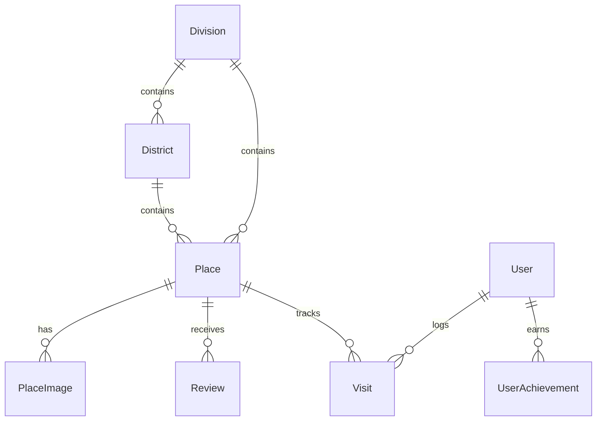

# ExploreBD Backend Architecture & Data Documentation (English)

## 1. System Overview
ExploreBD backend is a high-performance REST API built using **Node.js, Express, TypeScript, and Prisma ORM**, backed by an embedded **PostgreSQL** instance. It manages administrative hierarchies (Divisions and Districts), curated tourist destinations, multi-visit metrics, user tracking, and achievement structures.

---

## 2. Administrative Hierarchy & Spot Breakdown

| Division | Bengali Name | District Count | Active Seeded Spots | Notable Attractions |
| :--- | :--- | :---: | :---: | :--- |
| **Chattogram** | চট্টগ্রাম | 11 | **19** | Cox's Bazar, Sajek Valley, Sitakunda Eco Park, Saint Martin's Island, Nilgiri, Boga Lake, Naval Beach, Foy's Lake |
| **Dhaka** | ঢাকা | 13 | **8** | Lalbagh Fort, Ahsan Manzil, Panam City, National Parliament, Dhanmondi Lake, Ramna Park, Star Mosque |
| **Sylhet** | সিলেট | 4 | **5** | Sreemangal Tea Gardens, Ratargul Swamp Forest, Bichanakandi, Jaflong, Madhabkunda Waterfall, Tanguar Haor |
| **Khulna** | খুলনা | 10 | **2** | Sundarbans National Park, Sixty Dome Mosque (Bagerhat) |
| **Barishal** | বরিশাল | 6 | **1** | Kuakata Sea Beach (Daughter of the Sea) |
| **Rajshahi** | রাজশাহী | 8 | **1** | Somapura Mahavihara (Paharpur) |
| **Rangpur** | রংপুর | 8 | **1** | Kantajew Temple (Dinajpur) |
| **Mymensingh** | ময়মনসিংহ | 4 | **1** | Birishiri Ceramic Hills & Lake (Netrokona) |
| **TOTAL** | **৮ বিভাগ** | **64** | **38** | **National coverage across all 8 administrative divisions** |

---

## 3. District-Level Coverage
All **64 districts** exist as first-class relational entities in PostgreSQL. Each district contains:
- `name` (English name, e.g., "Cox's Bazar")
- `bnName` (Bengali name, e.g., "কক্সবাজার")
- `slug` (URL-safe identifier, e.g., "coxs-bazar")
- `divisionId` (Foreign key linking to Division)
- `coverImage` (Visual landscape cover)
- `latitude` & `longitude` (Geographic coordinates)
- `_count.places` (Aggregated count of tourist spots)

---

## 4. Database Schema Design (Prisma / PostgreSQL)

### Key Models:
1. **Division**: Top-level administrative regions (8 divisions).
2. **District**: Second-level administrative units (64 districts).
3. **Place**: Individual tourist destinations with categories (`WATERFALL`, `BEACH`, `HILL`, `FOREST`, `HISTORICAL`, `LAKE`, `RIVER`, `MUSEUM`, `PARK`, `RELIGIOUS`).
4. **PlaceImage**: Photo gallery items for places.
5. **Visit**: Tracks user visits, repeat count, and timestamps.
6. **User & RefreshToken**: Authentication and profile management.

---

## 5. Performance Optimizations & Caching
- **HTTP Cache-Control Headers**: All read-only GET endpoints return `Cache-Control: public, max-age=60, stale-while-revalidate=300`.
- **Database Indexing**: Indexed on `slug`, `email`, and `username` for 1ms lookup speeds.
- **Embedded PostgreSQL**: Runs with zero cloud dependency directly on port `5432`.

---

## 6. Database Backups
Automated backup utility is located at `backend/src/scripts/backup-database.ts`.
- **Execution Command**: `npm run db:backup --workspace=backend`
- **Output**: Exports both full JSON snapshot and raw SQL `INSERT` statements into `backend/backups/`.
- **Git Safety**: `backend/backups/` and `backend/data/` are strictly ignored by `.gitignore`.
